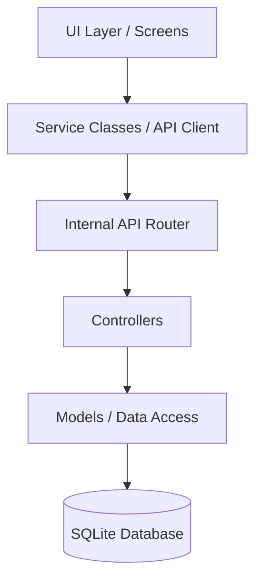

# Backend Architecture: Monoblock Routed API

This document describes the proposed architecture for a structured, routed internal API that interfaces with the SQLite3 database.

## 1. Architecture Overview

To transition from tight coupling to a scalable backend structure, we will implement a "Clean Architecture" pattern within our monorepo. This structure mimics a real REST API, making it easy to transition to a remote server in the future.

### Layers

1.  **UI Layer (Screens/Components)**: React Native components that trigger actions.
2.  **Service / API Client Layer**: Wrappers that make "API calls" to the internal router.
3.  **Internal API Router**: A central dispatcher that routes requests based on "URLs" and "Methods".
4.  **Controllers**: Logic handlers for specific resources (e.g., `UserController`, `FoodController`).
5.  **Data Access Layer (Models/SQLite)**: Direct interaction with SQLite using SQL queries.

### Data Flow Diagram



## 2. The Internal API Router

The router acts as the single entry point for all data operations. It receives a request object and returns a response object.

### Request Object Structure
```typescript
interface ApiRequest {
  path: string;       // e.g., '/foods', '/users/login'
  method: 'GET' | 'POST' | 'PUT' | 'DELETE';
  body?: any;
  params?: any;
}
```

### Response Object Structure
```typescript
interface ApiResponse<T = any> {
  status: number;     // 200, 201, 400, 401, 404, 500
  data?: T;
  error?: string;
}
```

## 3. Directory Structure

We will organize the backend logic under `src/api`:

```text
src/
├── api/
│   ├── router.ts             # Central routing logic
│   ├── middleware/           # Auth, logging, validation
│   ├── controllers/          # Business logic for each resource
│   │   ├── authController.ts
│   │   ├── foodController.ts
│   │   └── orderController.ts
│   ├── models/               # SQLite query logic
│   │   ├── userModel.ts
│   │   ├── foodModel.ts
│   │   └── orderModel.ts
│   └── utils/                # Database connection, helpers
└── services/                 # Frontend API Client (wrappers)
```

## 4. Example Workflow: Getting All Foods

1.  **UI**: `FoodScreen` calls `foodService.getAllFoods()`.
2.  **Service**: `foodService` calls `apiClient.get('/foods')`.
3.  **Router**: `router.ts` sees `GET /foods` and calls `foodController.getAll()`.
4.  **Controller**: `foodController` calls `foodModel.findAll()`.
5.  **Model**: `foodModel` executes `SELECT * FROM foods` on SQLite.
6.  **Response**: Data flows back up through the layers in a standard `ApiResponse` format.

## 5. Benefits

*   **Decoupling**: The UI and Services never see SQL or SQLite.
*   **Realism**: Uses status codes and standard request/response patterns.
*   **Testability**: Each layer (Controller, Model, Router) can be tested in isolation.
*   **Future Proof**: To move to a real backend, we only need to change the `apiClient` to use `fetch()` or `axios` instead of calling the internal router.

## 7. API Endpoints & Routes

The internal router will handle the following routes:

### Auth
*   `POST /auth/register` - Create new user.
*   `POST /auth/login` - Authenticate user.
*   `GET /auth/me` - Get current user profile.

### Foods
*   `GET /foods` - List all available foods.
*   `GET /foods/:id` - Get food details.
*   `POST /foods` - Add new food (Seller only).
*   `PUT /foods/:id` - Update food.
*   `DELETE /foods/:id` - Remove food.

### Orders
*   `GET /orders` - List orders for current user.
*   `POST /orders` - Place a new order.
*   `PUT /orders/:id/status` - Update order status (Seller/Buyer).

### Chats
*   `GET /chats` - List active chats.
*   `POST /chats` - Create or get existing chat.
*   `GET /chats/:id/messages` - Get messages for a chat.
*   `POST /chats/:id/messages` - Send a message.

## 8. Controller & Model Pattern

### Model Example (`src/api/models/foodModel.ts`)
```typescript
export const foodModel = {
  findAll: async () => {
    const results = await db.getAllAsync('SELECT * FROM foods WHERE isAvailable = 1');
    return results.map(row => ({
      ...row,
      ingredients: JSON.parse(row.ingredients as string)
    }));
  },
  // ... other methods
};
```

### Controller Example (`src/api/controllers/foodController.ts`)
```typescript
export const foodController = {
  getAll: async (req: ApiRequest): Promise<ApiResponse> => {
    try {
      const foods = await foodModel.findAll();
      return { status: 200, data: foods };
    } catch (error) {
      return { status: 500, error: 'Failed to fetch foods' };
    }
  }
};
```

## 9. Best Practice Analysis

For a marketplace application like **Coziyoo** (which involves multiple users like Buyers and Sellers interacting), the "best practice" depends on the stage of development:

### Is this the best approach?

1.  **For Development & Prototyping (YES)**: 
    *   Using the **Monoblock Routed API** pattern is a best practice because it creates a clear separation of concerns. 
    *   It allows the team to develop the entire business logic and UI flow without waiting for a server to be deployed.
    *   The "Routed" nature means you can swap the internal SQLite logic for a real remote API in one place (the `apiClient`) without touching a single UI component.

2.  **For Production (Remote Connectivity Required)**:
    *   A marketplace **cannot** run solely on SQLite on a local phone, as Sellers need to receive orders from Buyers in real-time.
    *   However, the architecture designed here is the **perfect bridge** to production. 
    *   When you are ready for a real backend, you simply move the `Controllers`, `Models`, and `Router` code to a Node.js server, and point the `apiClient` to that server's URL.

### Recommended Path
*   **Phase 1 (Current)**: Implement the **Monoblock Routed API** with **SQLite3** for persistence. This gives you a working, fast, and testable app.
*   **Phase 2 (Scalability)**: Move the `src/api` folder to a separate Node.js repository (or keep it as a monorepo package) and deploy it.
*   **Phase 3 (Production)**: Update the `apiClient` to use `fetch` to talk to the remote server. 

**Conclusion**: This architecture is the "best practice" for building a professional-grade app that is intended to grow from a local prototype to a full-scale cloud-based marketplace.
